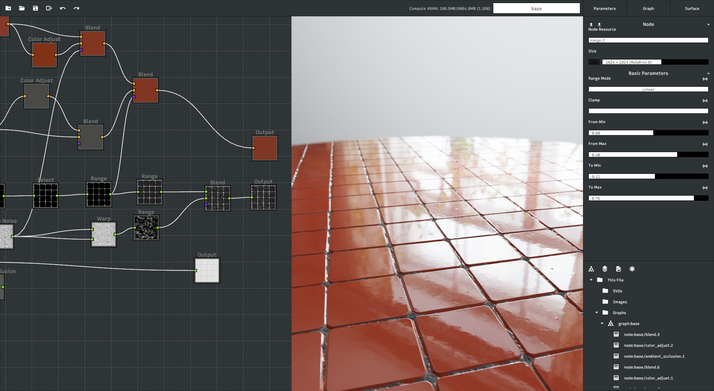

# surfacelab
A work-in-progress procedural texture generation app written in Rust.



# Getting Started
The application can be built by simply running
```
cargo build
```

You can run it analogously via `cargo run`

# License
Distributed under GPLv3 license.

# Contributing
Any contribution is greatly appreciated.
